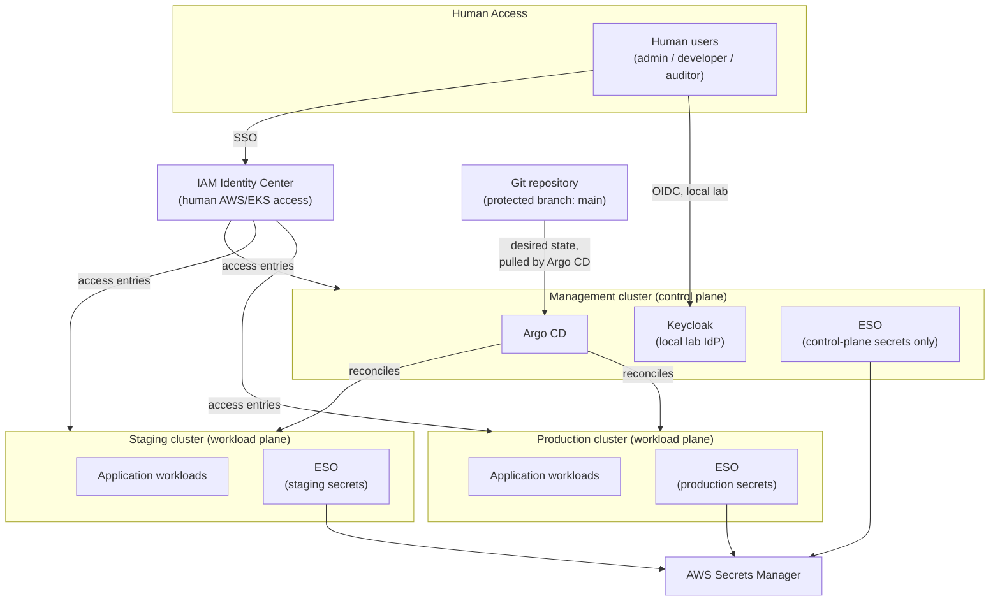
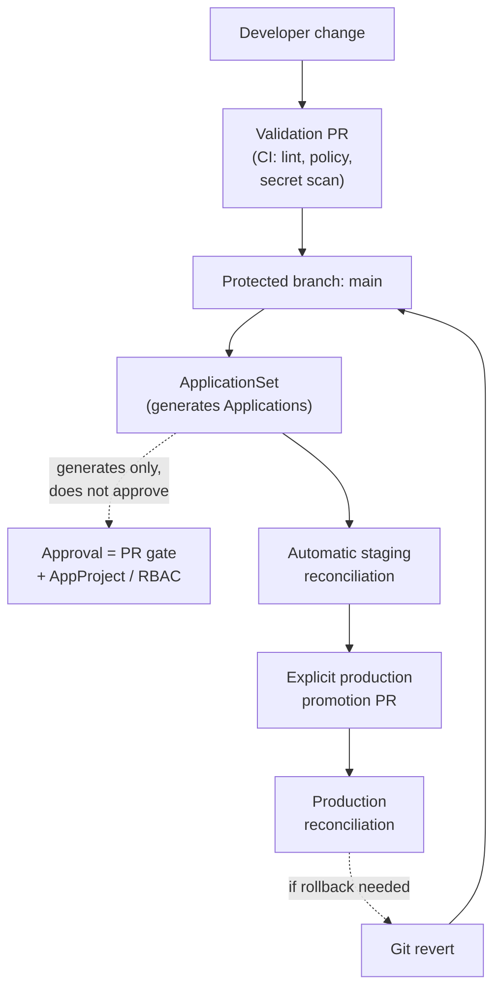
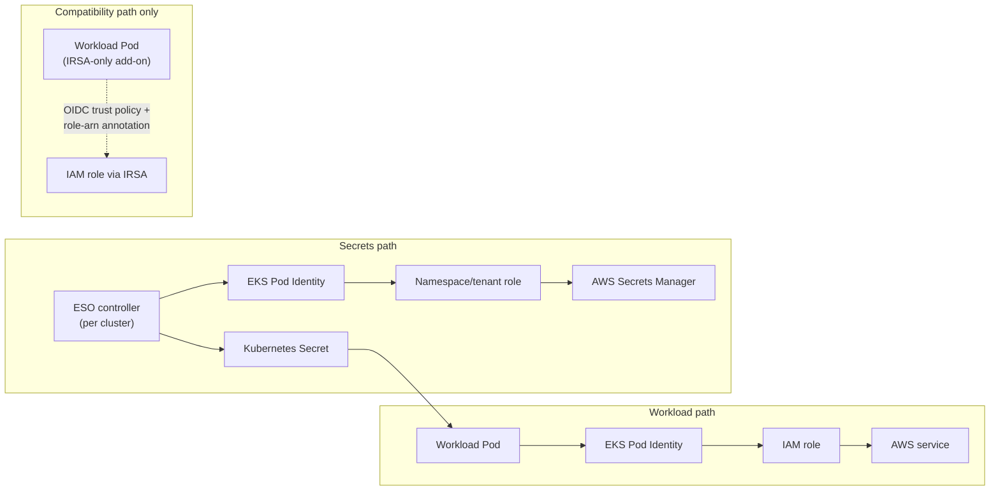

# Technical Architecture Document — eks-gitops-platform-project

## Document Control

| Field | Value |
|---|---|
| Document | eks-gitops-platform-project Technical Architecture |
| Version | 0.5.0 |
| Status | Architecture baseline |
| Phase | Phase 2.1 — Local tooling and kind foundation (implemented) |
| Last updated | 2026-08-31 |

This document is the **single, authoritative source of truth** for the
project's architecture: scope, principles, topology, control plane,
identity, secrets, security, risks, evidence, and roadmap. Diagrams are
inline Mermaid, versioned as part of this file; a standalone draw.io
diagram and a polished DOCX export are derived artifacts generated from
this document later (Phase 7), never an independent source to keep in
sync.

Architectural reasoning here stands on this project's own requirements
and on general, well-documented GitOps/Kubernetes/AWS engineering risks
— never on a claim that a specific external system, prior organization,
or private document informed a decision (see `AGENTS.md`).

## Executive Summary

`eks-gitops-platform-project` is a greenfield, portfolio-quality GitOps
platform for AWS EKS, built from scratch in small, reviewable phases. It
demonstrates: reproducible AWS/EKS infrastructure via Terraform; workload
identity without static credentials (EKS Pod Identity, IRSA as
compatibility); secrets that never enter Git (External Secrets Operator
+ AWS Secrets Manager, run per cluster, under a layered isolation model);
Argo CD reconciling a closed set of environments through
`ApplicationSet`; and production promotion gated by a reviewed PR
**plus** runtime trust boundaries (`AppProject`, RBAC, least-privilege
credentials) — the PR alone is treated as necessary, not sufficient.

As of this version, **nothing has been implemented**. This document
describes the target architecture and the decisions behind it; the
[evidence table](#evidence-and-implementation-status) states plainly
that no runtime capability is `VERIFIED` yet. An `Accepted` ADR below
records an approved decision — it does not mean that decision has been
implemented.

## Scope and Non-Goals

**In scope:** a local, reproducible `kind`-based lab; a target AWS/EKS
Terraform substrate (plan-only until authorized); Argo CD +
`ApplicationSet` with an explicit trust model; a standard workload
contract; human identity (IAM Identity Center, Keycloak for the local
lab) and workload identity (Pod Identity, IRSA); secrets management with
a layered, per-cluster isolation model; PR-gated environment promotion.

**Non-goals:** a general-purpose internal-developer-portal UI; support
for cloud providers other than AWS; a self-service infrastructure
catalog in the MVP (Crossplane or equivalent — deferred, see ADR-0001);
Progressive Delivery as the primary production gate; three permanently
running EKS clusters; generating application workloads for the
`management` cluster; deciding Argo CD's production AWS identity
provider ahead of Phase 3/4 (see "Human Identity and SSO").

## Architecture Principles

1. **A single Git repository is the desired-state source of truth** for
   everything Argo CD reconciles.
2. **Application and infrastructure concerns are separated** — the
   standard workload chart never provisions cloud infrastructure.
3. **Identity contracts between independently evolving systems are
   tested, never assumed.** The (cluster, namespace, `ServiceAccount`)
   tuple that Terraform and the workload chart must agree on is covered
   by an automated contract test before it is trusted.
4. **Every required CI check blocks the merge it protects** — no
   required check is ever configured to continue past a failure.
5. **A reviewed pull request is necessary, but not sufficient, for
   production promotion** — it is paired with `AppProject` boundaries,
   Argo CD RBAC, and least-privilege cluster credentials.
6. **Pinning applies to what is consumed, not to the desired-state
   branch itself** — `main` may be tracked continuously because it is
   protected by review; external dependencies are pinned immutably.
7. **No control-plane component's identity is shared across clusters
   for convenience** — each cluster that needs to act on AWS (including
   each cluster's ESO instance) has its own scoped identity.
8. **Confidence is labeled honestly** — a capability described only in
   documentation is never `VERIFIED`.

## System Context

Argo CD **pulls** the desired state from Git and reconciles it toward
`staging` and `prod` — Git is a source Argo CD reads, not something Argo
CD reconciles. `management` is the control plane only; it is never a
workload plane. Every cluster that creates Kubernetes `Secret`s runs its
**own** ESO instance against AWS Secrets Manager — none is shared. See
"Cluster and Environment Topology."

## Cluster and Environment Topology

| Environment | Role | Control-plane add-ons | Workload-cluster runtime add-ons | Application workloads |
|---|---|---|---|---|
| `management` | Control plane | Argo CD; Keycloak (local lab only); ESO, if a control-plane component needs a secret (e.g. Argo CD's OIDC client secret) | — | **No** |
| `staging` | Workload plane | — | Its own ESO instance, own Pod Identity association, own namespace-scoped `SecretStore`s and IAM roles | Yes — auto-reconciled |
| `prod` | Workload plane | — | Its own ESO instance, own Pod Identity association, own namespace-scoped `SecretStore`s and IAM roles, fully separate from staging | Yes — PR-promoted only |

**No ESO controller instance is shared across clusters.** This
distinguishes three categories: **control-plane add-ons** (`management`
only), **workload-cluster runtime add-ons** (`staging`/`prod`, including
each cluster's own ESO), and **application workloads** (`staging`/`prod`
only, never `management`).

**Local lab profiles:**
- `lab-lite` — **implemented as of Phase 2.1**: one `kind` cluster
  (`kindest/node:v1.36.4`, pinned by digest), single control-plane node.
  As of Phase 2.1 it is only the cluster itself — `staging`/`production`
  namespaces, Argo CD, and any workload are added in later Phase 2
  increments (2.2/2.3), never created imperatively (see "GitOps Control
  Plane" for the imperative/declarative boundary). Namespace-level
  environment simulation validates GitOps generation, RBAC, destination
  restrictions, and reconciliation logic — it does **not** prove real
  cluster-level isolation.
- `lab-multicluster` — documented, not created. Three separate `kind`
  clusters, one per environment; reserved for deliberate, manual
  execution once `lab-lite` passes all its criteria (Phase 2.7). Real
  `management`/`staging`/`production` cluster separation is validated
  only there.

**Local toolchain and isolation (Phase 2.1):** `kind v0.33.0` and
`kubectl v1.36.4` run from project-local, checksum-pinned binaries
(`.tools/bin/`, gitignored, installed only via `make tools-install` —
never the machine's global `kubectl`/`kind`). The cluster's kubeconfig
lives at `.local/kubeconfig` (gitignored), never merged into
`~/.kube/config` and never read from an ambient `KUBECONFIG` — every
`lab/kind/*.sh` and `tests/lab/*.sh` script passes both explicitly. This
keeps the lab isolated from any EKS context, Docker Desktop Kubernetes,
or other `kind` clusters on the same machine.

**AWS**: Terraform prepares one VPC/EKS root per environment; **no AWS
cluster exists by default**. Staging is the first candidate for a
temporary environment once authorized; production stays plan-only until
a separate authorization. No AWS cluster runs permanently for the lab.
See ADR-0002.

## GitOps Control Plane

Argo CD, running in `management`, reads the protected `main` branch of
this repository and reconciles it toward `staging` and `prod`.
`ApplicationSet` generates `Application` objects from an explicit, closed
environment list/matrix (never free text) — it **generates, it does not
authorize**. `AppProject` boundaries restrict allowed source
repositories, destination cluster/namespace pairs, and resource kinds
per trust domain. Control-plane add-ons and application workloads use
distinct GitOps boundaries — never the same `AppProject` or generator.
See ADR-0003.

**Imperative/declarative boundary across Phase 2 increments:** Phase 2.1
creates only the `kind` cluster itself — never `staging`, `production`,
`ApplicationSet`, `AppProject`, or any Argo CD resource. Phase 2.2's
bootstrap is a narrow, explicit exception: it may imperatively create
only what installing the GitOps controller itself requires (the Argo CD
namespace and the pinned Argo CD Helm release) — it does not create the
root/bootstrap `Application`, any `AppProject`, or any `ApplicationSet`.
Phase 2.3 narrows the imperative surface to exactly two objects: the
Argo CD repository-credential `Secret` and the root `Application`
(`platform-bootstrap`) itself. Everything the root `Application` points
at — the `AppProject`, the `ApplicationSet`, the `Application` objects
it generates, `staging`/`production`, and their `ConfigMap`s — is
rendered by the `gitops/bootstrap` Helm chart and reconciled
**declaratively** by Argo CD from there on. See ADR-0007.

### Local Lab Private GitOps Bootstrap (Phase 2.3)

`lab/gitops/*.sh` (backing the `make gitops-*` targets) gives the
already-installed Argo CD read-only SSH access to this repository and
bootstraps exactly one root `Application`.

- **Credential**: a repository-scoped, read-only Ed25519 deploy key —
  never a Personal Access Token, never a personal SSH key, never a
  GitHub App (see ADR-0007 for the full comparison). The private key
  lives only at `.local/gitops/github-deploy-key` (gitignored, mode
  `0600`) and as the `eks-gitops-platform-project-repo` Argo CD
  repository `Secret`; no script ever prints it — identity is verified
  by comparing SHA256 hashes and the (non-secret) repository URL only.
- **Root → chart relationship**: the root `Application` points at the
  dependency-free `gitops/bootstrap` Helm chart and passes its own Git
  revision through as a Helm value, so the `ApplicationSet` it renders —
  and every `Application` that `ApplicationSet` generates — always
  tracks the exact same revision as the root itself.
- **Environment generation**: a deterministic Helm `list` generator (not
  a `git`/`directory` generator) produces exactly two `Application`
  objects, `platform-smoke-staging` and `platform-smoke-production` —
  both now single-Helm-source Applications reading the constant path
  `charts/standard-workload` (Phase 2.4) with a per-environment
  `helm.valueFiles` entry, rather than a per-environment plain-manifest
  path — a third environment requires an explicit, reviewed chart
  change, never a stray file drop.
- **AppProject**: exactly one `sourceRepos` entry, exactly the
  `staging`/`production` destinations, exactly one cluster-scoped grant
  (`{group:"",kind:Namespace}`, proven necessary for `CreateNamespace=true`
  — an empty whitelist makes it fail, see ADR-0007) and, as of Phase 2.4,
  exactly the four namespace-scoped kinds `charts/standard-workload`
  renders (`ConfigMap`, `Service`, `ServiceAccount`,
  `apps/Deployment`) — no project `roles`, no wildcard group or kind.
- **Self-heal and prune** are enabled throughout — this is a single
  local `kind` cluster with no other tenant and no shared blast radius,
  so the tradeoffs that justify disabling `selfHeal` in a real
  multi-tenant production environment do not apply yet.
- **Namespace ownership**: `staging`/`production` carry the same
  `eks-gitops-lab-lite.local/owner: gitops-bootstrap` label Phase 2.2
  already established for the `argocd` namespace; `make gitops-uninstall`
  only ever deletes a namespace carrying that exact label and only after
  an exhaustive, `kubectl api-resources --namespaced`-driven inventory
  shows nothing unexpected remains.
- **Idempotency, proven not assumed**: `make gitops-bootstrap` is
  fail-closed — absent → applies the root `Application`; an exact match
  → a true no-op (its `resourceVersion` is asserted unchanged, not just
  "probably fine"); any drift → refuses to reconcile automatically.
  `make gitops-test-lifecycle` additionally proves that a deliberate,
  single-environment `ConfigMap` drift self-heals from Git within 90
  seconds while the other environment is provably unaffected, and that
  a foreground-cascading uninstall removes exactly the Phase 2.3
  workload resources while leaving Argo CD, its CRDs, the repository
  Secret, and the deploy key untouched.

### Local Lab Argo CD Bootstrap (Phase 2.2)

`lab/argocd/*.sh` (backing the `make argocd-*` targets) installs Argo CD
into the Phase 2.1 `lab-lite` `kind` cluster, entirely offline once the
chart is fetched, and entirely isolated to the project-local toolchain
and kubeconfig — the same isolation discipline as Phase 2.1.

- **Chart:** `argo-helm/argo-cd` `10.4.2` (app version `v3.5.2`), fetched
  once as an immutable GitHub Release `.tgz` asset and SHA256-pinned in
  `scripts/argocd/_lib.sh` — never `helm repo add`, never a floating
  version. `make argocd-chart-fetch` is the only target permitted to
  download it; every other target requires it already present and
  checksum-verified.
- **Tooling:** Helm `v4.2.4`, installed the same way as `kind`/`kubectl`
  in Phase 2.1 — a pinned, checksum-verified download into
  `.tools/bin/helm` — except Helm ships as a `tar.gz` archive, so
  `scripts/lab/install-tools.sh` extracts exactly one validated,
  non-symlink, regular-file archive member before verifying and
  installing it.
- **Images:** every rendered image reference is digest-pinned
  (`repository:tag@sha256:digest`) — `quay.io/argoproj/argocd:v3.5.2` and
  `ecr-public.aws.com/docker/library/redis:8.6.4-alpine`, each verified
  against the registry's own `Docker-Content-Digest` at pin time.
  `dex` and `notifications-controller` are disabled; `make argocd-render`
  proves both are absent from the render and that no tag-only image
  exists.
- **Values contract:** `lab/argocd/values-lab.yaml` is the single,
  explicit source of every override — one replica per component,
  `ClusterIP`-only `server` service, ingress disabled, explicit
  CPU/memory requests and limits on every rendered container and init
  container (including the `copyutil` init container and the
  `redis-secret-init` pre-install hook `Job`), and `crds.keep: true` so
  Argo CD's CRDs survive an `uninstall`.
- **Idempotency, proven not assumed:** `make argocd-install` is
  fail-closed — absent → installs; an exact match against the pinned
  chart, values fingerprint, and live manifest → a true no-op (no `helm
  upgrade` call at all); any drift in any of those → refuses to
  reconcile automatically and fails closed. `make argocd-test-lifecycle`
  exercises install → install (asserting the Helm release revision, the
  live manifest checksum, and every managed workload's
  `.metadata.generation` are byte-identical — proving no rollout
  occurred) → uninstall (asserting the exact three Argo CD CRDs are
  retained and still schema-compatible via `kubectl diff`, and that no
  unexpected `*.argoproj.io` CRD exists) → uninstall no-op → a
  restoration install using those retained CRDs, leaving Argo CD
  installed and healthy at the end.
- **Namespace ownership:** the `argocd` namespace carries a dedicated
  `eks-gitops-lab-lite.local/owner=argocd-bootstrap` label (not the
  generic `app.kubernetes.io/managed-by`); `make argocd-uninstall` only
  ever deletes it when this bootstrap owns it and an exhaustive
  namespaced-resource inventory (every `kubectl api-resources
  --verbs=list --namespaced` type, not just `kubectl get all`) shows
  nothing beyond the two objects Kubernetes itself always creates.
- **Admin access:** the initial-admin `Secret`'s password is decoded
  manually (`kubectl ... -o jsonpath='{.data.password}' | base64 -D` on
  macOS) — never scripted, logged, or written to any evidence file — and
  is expected to be deleted once a replacement auth method is in place.
  `make argocd-port-forward` exposes the UI/API at
  `https://localhost:8443` in the foreground only.

## Application Delivery and Promotion

Staging reconciles automatically from `main`. Production is promoted
only through a **separate, explicit PR** that bumps a pinned
external-dependency value (chart version, image digest) — never a direct
commit. Rollback is a Git revert of the promotion commit, reconciled the
same way. The PR gate is necessary but not sufficient: it is paired with
the `AppProject`/RBAC/least-privilege-credential controls in "Security
and Trust Boundaries." See ADR-0003.

## Workload Deployment Contract

One standard Helm chart renders every workload: `Deployment`/`Service`,
an explicit `ServiceAccount` `identityMode` (`podIdentity` / `irsa` /
`none` — see "Workload Identity"), startup/readiness/liveness probes,
resource requests/limits, an HPA that does not fight a static replica
count, a `PodDisruptionBudget`, topology-spread/anti-affinity, graceful
termination, `NetworkPolicy`, optional `Ingress`, an optional
metrics/`ServiceMonitor` interface, and digest-pinned images. The chart
never provisions cloud infrastructure and fails clearly on invalid
values — every documented field is backed by a template that reads it.
See ADR-0006.

## Human Identity and SSO

- **Human → AWS/EKS:** AWS IAM Identity Center; EKS access entries mapped
  to groups. This is settled.
- **Human → Argo CD, local lab:** Keycloak, direct OIDC — no Dex broker
  unless a concrete multi-connector need appears later. **Keycloak is
  the reproducible identity provider for the local lab only; this
  document does not assert it will be the production identity
  provider.**
- **Human → Argo CD, production AWS:** the identity provider is
  **`UNKNOWN`**, pending an explicit decision in Phase 3/4. The local
  lab's job is to prove the OIDC/RBAC mechanism (authenticate, map to a
  role, enforce that role) — not to pre-select a production IdP.
- Roles: platform administrator, application developer (scoped to owned
  namespaces), read-only auditor. `admin` is a bootstrap/break-glass
  fallback, not the standing path once OIDC is configured.
- Bootstrap: the Keycloak↔Argo CD OIDC secret is generated locally,
  stored only as an ephemeral in-cluster `Secret`, never written to Git.
  In AWS, Argo CD may start without SSO; the `management`-cluster ESO
  instance is installed before OIDC is finalized; the secret then lives
  in Secrets Manager. See ADR-0005.

## Workload Identity

EKS Pod Identity is the default: no `eks.amazonaws.com/role-arn`
annotation, requires the Pod Identity Agent, bound via a
Terraform-managed (cluster, namespace, `ServiceAccount`) association.
IRSA is an explicit compatibility path only — OIDC provider, trust
policy, and the annotation — never a silent fallback and never described
as the same mechanism as Pod Identity. The contract that must be tested
is the (cluster, namespace, `ServiceAccount`) tuple; `kind` validates its
shape only — it cannot prove Pod Identity itself. See ADR-0004.

## Secrets Management

External Secrets Operator runs as a **separate instance in every
cluster** that needs to create Kubernetes `Secret`s — `management`
(control-plane secrets only), `staging`, and `prod`. **No ESO controller
instance is shared across clusters.** Each instance reconciles secrets
from AWS Secrets Manager under a layered model: IAM least privilege,
Kubernetes RBAC, that cluster's own ESO controller identity (via its own
Pod Identity association), and — where feasible — per-namespace/tenant
assumable roles scoped to that cluster. A namespace-scoped `SecretStore`
is the default in every cluster, referencing that cluster's own scoped
role; it is **not by itself the security boundary** — real isolation is
the combination of all layers above, evaluated per cluster.
`ClusterSecretStore` requires a separate, explicit decision, per cluster
if ever adopted. See ADR-0004.

## Terraform and Bootstrap Boundary

Terraform provisions AWS infrastructure (VPC, EKS, IAM baseline, KMS,
Pod Identity associations for every cluster's workloads and ESO
instance) and Argo CD's initial bootstrap installation only. After
bootstrap, Argo CD manages its own declarative configuration — Terraform
does not keep patching it. The OIDC-secret bootstrap ordering (Argo CD
may start without SSO → the `management`-cluster ESO instance installed
→ OIDC finalized) and its open seeding question are described in
ADR-0005; Terraform must never store a secret's plaintext value in state.
See ADR-0001 and ADR-0005.

## Security and Trust Boundaries

- `AppProject` per trust domain; Argo CD RBAC; a restricted set of
  principals allowed to modify `ApplicationSet` definitions; a documented
  sync/prune policy; least-privilege Argo CD cluster credentials.
- **Explicit threat-model statement:** a compromised Argo CD controller,
  or an over-privileged/admin-level cluster credential, can mutate a
  cluster directly regardless of branch protection. This is why the PR
  gate (ADR-0003) is paired with the runtime controls above, not treated
  as sufficient alone.
- Secrets isolation depends on the layered, per-cluster model in
  "Secrets Management" — a namespace-scoped `SecretStore` is not a
  boundary by itself, and no ESO identity is shared across clusters.
- No long-lived AWS access keys are permitted anywhere in this
  repository (checked by `scripts/validate/check-secrets.sh`, within its
  documented pattern coverage).

## Observability and Operations

`NOT IMPLEMENTED`. The standard chart reserves a metrics/`ServiceMonitor`
interface without forcing a Prometheus dependency. An observability
stack, runbooks, and failure drills are Phase 6 scope.

## Availability and Recovery

`NOT IMPLEMENTED`. Backup/DR boundaries and single-point-of-failure
analysis for the GitOps delivery path (including the bootstrap-cycle
risk in the table below) are Phase 6 scope.

## Costs and FinOps

| Item | Cost | Status |
|---|---|---|
| Local lab (`lab-lite` or `lab-multicluster`) | No AWS service charges — runs on local Docker | `PROPOSED` — neither profile exists yet |
| Terraform plan-only | No AWS service charges | `PROPOSED` as a standing rule |
| One EKS cluster, standard support, control plane only | ≈US$0.10/hour | `INFERRED` — public AWS pricing at time of writing, not re-verified live |
| Three EKS control planes running continuously | ≈US$219/month, before nodes/NAT/storage/transfer | `INFERRED` — same caveat; why this project never runs three permanent clusters |

"No AWS service charges" means no billed AWS resource consumption — it
is not a claim of zero cost in every sense (local compute/electricity is
not counted). All figures must be re-verified against current AWS
pricing before any real deployment. **No AWS resource is created without
a fresh, explicit authorization.**

## Architecture Decisions

| ADR | Decision | Status |
|---|---|---|
| [ADR-0001](../adr/0001-platform-scope-and-boundaries.md) | Platform scope and repository boundaries | Accepted |
| [ADR-0002](../adr/0002-environment-topology.md) | Environment topology | Accepted |
| [ADR-0003](../adr/0003-gitops-control-plane-and-promotion.md) | GitOps control plane and promotion | Accepted |
| [ADR-0004](../adr/0004-workload-identity-and-secrets.md) | Workload identity and secrets | Accepted |
| [ADR-0005](../adr/0005-sso-bootstrap-and-cluster-access.md) | SSO, bootstrap, and cluster access | Accepted |
| [ADR-0006](../adr/0006-standard-workload-contract.md) | Standard workload contract | Accepted |
| [ADR-0007](../adr/0007-private-gitops-bootstrap.md) | Private repository GitOps bootstrap | Accepted |
| [ADR-0008](../adr/0008-standard-workload-before-sso.md) | Standard workload contract before SSO | Accepted |
| [ADR-0009](../adr/0009-repository-governance-baseline.md) | Repository governance baseline | Accepted |
| [ADR-0010](../adr/0010-external-secrets-operator-contract.md) | External Secrets Operator contract | Accepted |

Each ADR above records an **approved decision**, not an implemented one
— every capability it describes is tracked honestly in "Evidence and
Implementation Status" below.

## Risks and Open Questions

| ID | Risk | Impact | Mitigation | Status |
|---|---|---|---|---|
| R-01 | The (cluster, namespace, `ServiceAccount`) Pod Identity contract is untested against real EKS | High | Shape-test in `kind`; positive/negative test against a temporary, authorized EKS cluster (ADR-0004) | Open |
| R-02 | Any cluster's ESO controller identity could be over-privileged, making that cluster's namespace-scoped `SecretStore`s a nominal boundary only — evaluated per cluster and per tenant | High | Per-cluster, per-namespace/tenant assumable roles; IAM least privilege; no ESO identity shared across clusters (ADR-0002, ADR-0004) | Open |
| R-03 | A compromised Argo CD controller or admin-level cluster credential can mutate a cluster regardless of branch protection | High | `AppProject`, Argo CD RBAC, least-privilege cluster credentials (ADR-0003) | Open |
| R-04 | Bootstrap cycle between Argo CD, the `management`-cluster ESO instance, and the OIDC client secret | Medium | Documented ordering; OIDC-secret seeding mechanism explicitly `UNKNOWN` pending Phase 4 (ADR-0005) | Open |
| R-05 | Remote EKS cluster access/credentials for Argo CD not yet designed | Medium | Explicitly deferred to Phase 3/4 with a least-privilege requirement stated up front (ADR-0005) | Open |
| R-06 | No CI or branch protection exists yet — the PR-gate design is unenforced | High (if a mutating change happened today) | No remote is configured during this phase; tracked for the phase that introduces one | Open |
| R-07 | AWS costs could be incurred without authorization | High if it happened | Standing rule: no `apply` without fresh, explicit, scoped authorization | Mitigated by policy, not tooling yet |
| R-08 | TAD/code drift as implementation begins | Medium | TAD updated in the same PR as any architecture change (`AGENTS.md`) | Open |
| R-09 | Secret and confidentiality-term scanning is pattern-based, not exhaustive | Medium | Documented explicitly in each script; never presented as a complete scanner | Accepted limitation |
| R-10 | `lab-multicluster` may be too resource-intensive for routine local iteration | Low | `lab-lite` is the default; `lab-multicluster` used deliberately | Open |

## Evidence and Implementation Status

| Capability | Status | Evidence required |
|---|---|---|
| Repository foundation (TAD, ADRs, validation scripts) | `CODE-CONFIRMED` | Files exist and pass `make validate` |
| Local documentation validation (`make validate`) | `VERIFIED`, within each script's documented pattern coverage | Executed with a reproducible result during this phase |
| Target architecture described in this document | `PROPOSED` | Design only; nothing deployed |
| Local lab tooling (`make tools-check`/`tools-install`, `lab/kind/*.sh`) | `VERIFIED` | Executed in this phase: `make tools-install` downloaded and checksum-verified `kind v0.33.0`/`kubectl v1.36.4` into `.tools/bin/`; `make tools-check` confirmed them read-only |
| `lab-lite` cluster: creation, idempotency, teardown, identity match | `VERIFIED`, scoped to exactly what was exercised (cluster lifecycle and identity — not Argo CD/workloads, which remain `NOT IMPLEMENTED`) | `make lab-test-lifecycle` proved create→create(no-op)→destroy→destroy(no-op); the persistent cluster was then created and confirmed: server `v1.36.4` exactly, node image digest matches the pin, node `Ready`, reachable only via `.local/kubeconfig`, no `staging`/`production`/`argocd` namespace present |
| `lab-multicluster` | `NOT IMPLEMENTED` | Reserved for Phase 2.7, not created |
| Repository governance baseline (Dependabot, Actions policy, merge-button policy) | `PARTIALLY VERIFIED` at commit time — the five settings are applied and read back via the GitHub API after this PR opens, with the result recorded in that PR's description rather than asserted here in advance | `.github/dependabot.yml` renders exactly one `github-actions` ecosystem entry; `main` branch protection and repository rulesets remain confirmed absent and plan-gated (`NOT IMPLEMENTED` — private repository on GitHub Free; see ADR-0009) |
| Argo CD control-plane bootstrap in `lab-lite` (`make argocd-*`) | `VERIFIED`, scoped to exactly what was exercised (Argo CD's own install/uninstall/upgrade lifecycle — not `ApplicationSet`/`Application` reconciliation behavior, which remains `NOT IMPLEMENTED` until Phase 2.3) | `make argocd-chart-fetch` downloaded and checksum-verified `argo-cd-10.4.2.tgz`; `make argocd-render` confirmed all 7 rendered image occurrences (2 distinct images) are digest-pinned and dex/notifications are absent; `make argocd-test-lifecycle` proved install→install(true no-op: Helm revision, live-manifest sha256, and every managed workload's `.metadata.generation` byte-identical)→uninstall(exactly the 3 pinned CRDs retained and `kubectl diff`-compatible)→uninstall(no-op)→restoration install using those retained CRDs, ending installed and healthy; a further two `make argocd-install` runs confirmed persistence (second run a true no-op) |
| Private repository GitOps bootstrap (`make gitops-*`) | `PARTIALLY VERIFIED` at commit time — offline render and repository-authentication provisioning verified pre-merge; the runtime bootstrap/self-heal/uninstall lifecycle is verified via this phase's own PR feature-branch lifecycle test, whose result is recorded in that PR's description (and, if a correction was needed after that run, in a follow-up commit's message) rather than asserted here in advance | `make gitops-render` confirmed the chart renders exactly 1 `AppProject`, 1 `ApplicationSet` with exactly 2 generator elements, 0 `Secret` objects, no wildcard permissions, and correct revision propagation; `make gitops-repo-setup` provisioned the deploy key/GitHub deploy key/repository Secret and was confirmed idempotent (re-run is a true no-op); client- and server-side `kubectl apply --dry-run` passed for the root Application, the rendered AppProject/ApplicationSet, and both environment ConfigMaps |
| Argo CD reconciliation / `ApplicationSet` behavior | `VERIFIED`, scoped to exactly what Phase 2.4's lifecycle test exercises | Scope is exactly `platform`/`platform-environments`/`platform-smoke-{staging,production}`, each now rendering `charts/standard-workload` (`Deployment`/`Service`/`ServiceAccount`/`ConfigMap`) instead of a bare `ConfigMap` — no other `Application`/`ApplicationSet`/`AppProject` exists |
| Standard workload contract (`charts/standard-workload`) | `VERIFIED`, scoped to the mandatory baseline only (Ingress/HPA/PDB/NetworkPolicy/ServiceMonitor remain `NOT IMPLEMENTED`, tracked in ADR-0006's phased-implementation note) | `make check-standard-workload-chart` proved the rendered-kind allowlist, digest-only images, Restricted-PSS fields, matching Service/Deployment selectors, and 13 deterministic post-merge negative schema cases; the Phase 2.4 lifecycle test proved both environments' Deployment/Service/ServiceAccount/ConfigMap, in-cluster reachability, correct differing `/api/info` messages, a checksum-triggered rollout via two real Git commits, and production's isolation from the staging-only change |
| EKS Pod Identity workload access | `UNKNOWN` | Requires a real, temporary, authorized EKS cluster |
| Workload-identity (cluster/namespace/ServiceAccount) contract | `NOT IMPLEMENTED` | No contract test exists |
| External Secrets Operator bootstrap (`make eso-*`) | `PARTIALLY VERIFIED` at commit time — offline collision/ownership render proof verified pre-merge (`make eso-render`: exactly 25 CRDs, no scoped-release collision, webhook/cert-controller singleton, zero structural wildcard RBAC, digest-only images); the runtime install/no-op/uninstall(CRD-retention)/restore lifecycle, the CRD field-ownership-conflict fail-closed preflight, and the singleton-dependency guards are verified via this phase's own PR feature-branch lifecycle test, whose result is recorded in that PR's description rather than asserted here in advance | `make eso-render` / `make check-eso-chart` proved the full collision gate offline; `make eso-test-lifecycle` proves install→true no-op (per-release Helm revision + manifest sha256 unchanged)→singleton-health guard (`status.sh` fails if production exists while staging's shared webhook is unhealthy)→simulated CRD field-ownership conflict (`install.sh` fails closed, zero mutation, never `--force-conflicts`)→singleton-dependency guard (`uninstall.sh staging` refused while production exists)→uninstall(25/25 CRDs retained)→uninstall(no-op)→restoration install, throughout preserving Argo CD and the standard-workload baseline and the global kubeconfig/context |
| Per-cluster External Secrets reconciliation under the layered model | `NOT IMPLEMENTED` | The operator itself is bootstrapped (see the row above); no `SecretStore`/`ExternalSecret`/target `Secret` exists yet — planned as Phase 2.6.2 |
| Production PR-gated promotion | `PROPOSED` | No remote, branch protection, or `AppProject` exists yet |
| Argo CD's production AWS identity provider | `UNKNOWN` | Explicitly undecided pending Phase 3/4 (ADR-0005) |
| Crossplane-based self-service infrastructure | `OUT OF SCOPE` | Deferred past the MVP (ADR-0001) |
| Progressive Delivery as primary production gate | `OUT OF SCOPE` | Not the design (see "Application Delivery and Promotion") |
| Cost estimates in "Costs and FinOps" | `INFERRED` | Public pricing at time of writing, not re-verified live |

No capability above `NOT IMPLEMENTED`/`PROPOSED`/`UNKNOWN` is claimed as
`VERIFIED` at the runtime level anywhere in this repository.

## Delivery Roadmap

- **Phase 0 — Discovery:** complete.
- **Phase 1 — Documentation foundation:** complete.
- **Phase 2 — Local GitOps lab:**
  - **2.1 — Local tooling and `kind` foundation:** implemented (pinned `lab-lite` cluster, project-local toolchain and kubeconfig; no Argo CD, no Keycloak, no `ApplicationSet` yet).
  - **2.2 — Argo CD bootstrap:** implemented (pinned, digest-verified Argo CD control plane installed offline via Helm into `lab-lite`; fail-closed idempotent install, proven true no-op, CRD retention, and restoration; dex/notifications disabled; no `ApplicationSet`/`Application`/`AppProject` yet).
  - **2.3 — Private repository GitOps bootstrap:** implemented (read-only SSH deploy key; root `Application` applied imperatively; `platform` `AppProject`, `platform-environments` `ApplicationSet`, and `staging`/`production` with a `platform-smoke` `ConfigMap` each, all reconciled declaratively from Git; see ADR-0007).
  - **2.4 — Standard workload contract:** implemented (`charts/standard-workload` - `Deployment`/`Service`/`ServiceAccount`/`ConfigMap`, Restricted-PSS-compliant, digest-pinned `podinfo`, replacing the ConfigMap-only smoke example; see ADR-0006's phased-implementation note and ADR-0008). Keycloak OIDC/Argo CD RBAC is **postponed, not rejected**, per ADR-0008 — still unnumbered as a future phase.
  - **2.5 — Repository governance baseline:** implemented (Dependabot vulnerability alerts and security updates enabled; `github-actions`-only Dependabot version updates; GitHub Actions restricted to selected/GitHub-owned actions with SHA pinning required; merge button restricted to merge commits only; see ADR-0009). `main` branch protection/rulesets remain plan-gated and unavailable on this private, GitHub-Free repository — the owner explicitly declined both GitHub Pro and public visibility, so `main` relies on process (PR + passing `validate`), not server-side enforcement, until that decision changes.
  - **2.6 — External Secrets Operator contract:**
    - **2.6.1 — Operator bootstrap:** implemented (External Secrets Operator `v2.10.0`/chart `2.10.0`; 25 CRDs applied once via `kubectl apply`, owned by no Helm release; two `scopedRBAC` controller releases, `eso-staging`/`eso-production`, each restricted to exactly one workload namespace; the cluster-wide webhook/cert-controller singleton runs from `eso-staging` only; see ADR-0010).
    - **2.6.2 — Secret reconciliation contract and workload consumption:** not started (`SecretStore`/`ExternalSecret`/read-only Secret-volume consumption in `charts/standard-workload`; planned in `.local/evidence/phase-2.6-external-secrets-plan.md`).
  - **2.7 — Multicluster profile:** not started.
  - **2.8 — Evidence and hardening:** not started.
- **Phase 3 — Terraform/EKS, plan-only:** not started.
- **Phase 4 — Identity and secrets:** not started.
- **Phase 5 — Promotion and governance:** not started.
- **Phase 6 — Hardening and operations:** not started.
- **Phase 7 — Final evidence, draw.io, and DOCX:** not started.

## Definition of Done

The project is done only when: a new engineer can launch the local lab
from documented prerequisites; `ApplicationSet` creates the intended
staging/production `Application` objects and never for `management`; the
workload-identity contract is contract-tested and EKS Pod Identity is
proven against a real, temporary, authorized EKS cluster; production
promotion requires a reviewed PR **and** the `AppProject`/RBAC/
least-privilege-credential controls; external dependencies are pinned
immutably while the desired-state branch itself is protected by review;
every cluster's ESO instance reconciles under the layered isolation model
with no secret value ever in Git; required CI checks are blocking and
green; this TAD and its six ADRs match the actual implementation; every
unverified runtime statement is labeled honestly; no
confidentiality-restricted material or its provenance is referenced
anywhere in this repository's history; and no AWS resource was created
without explicit authorization.

None of these criteria are met yet — Phase 1 delivers the architecture
baseline only; implementation begins in Phase 2.
